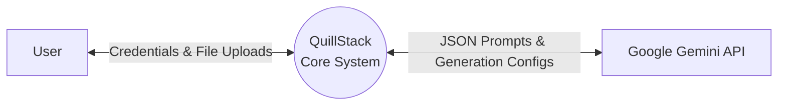
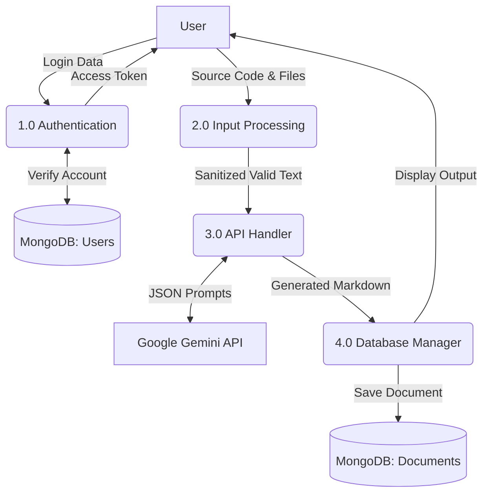
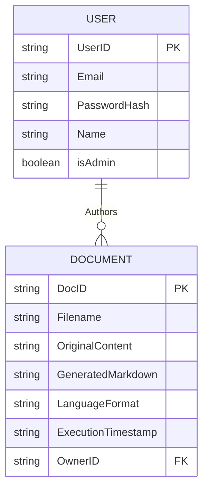
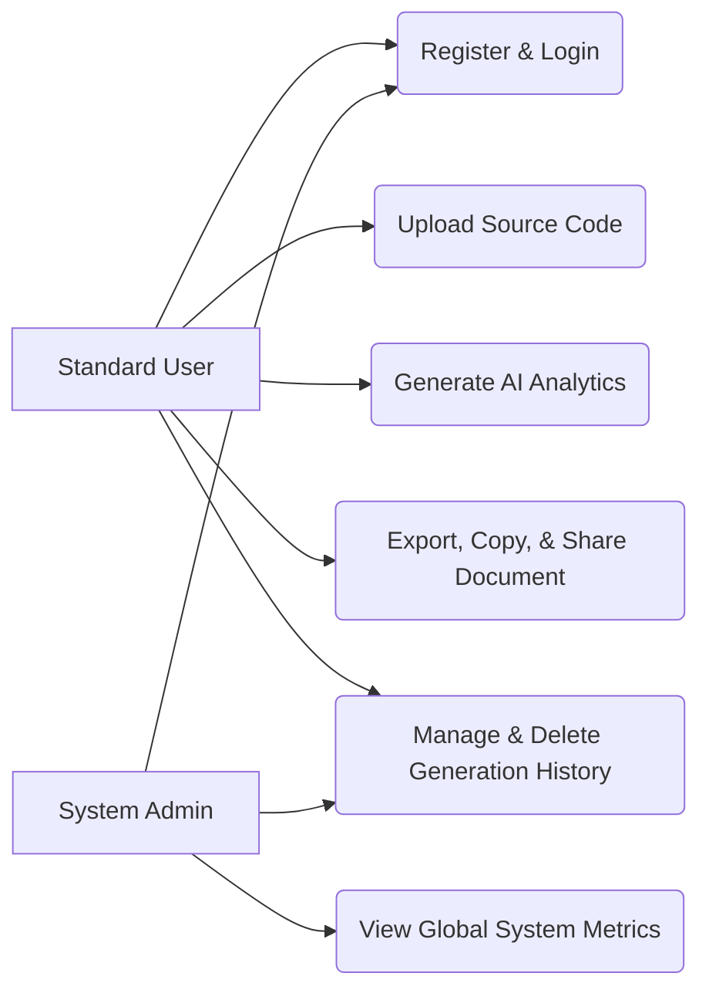
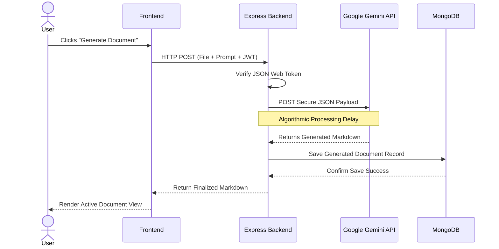
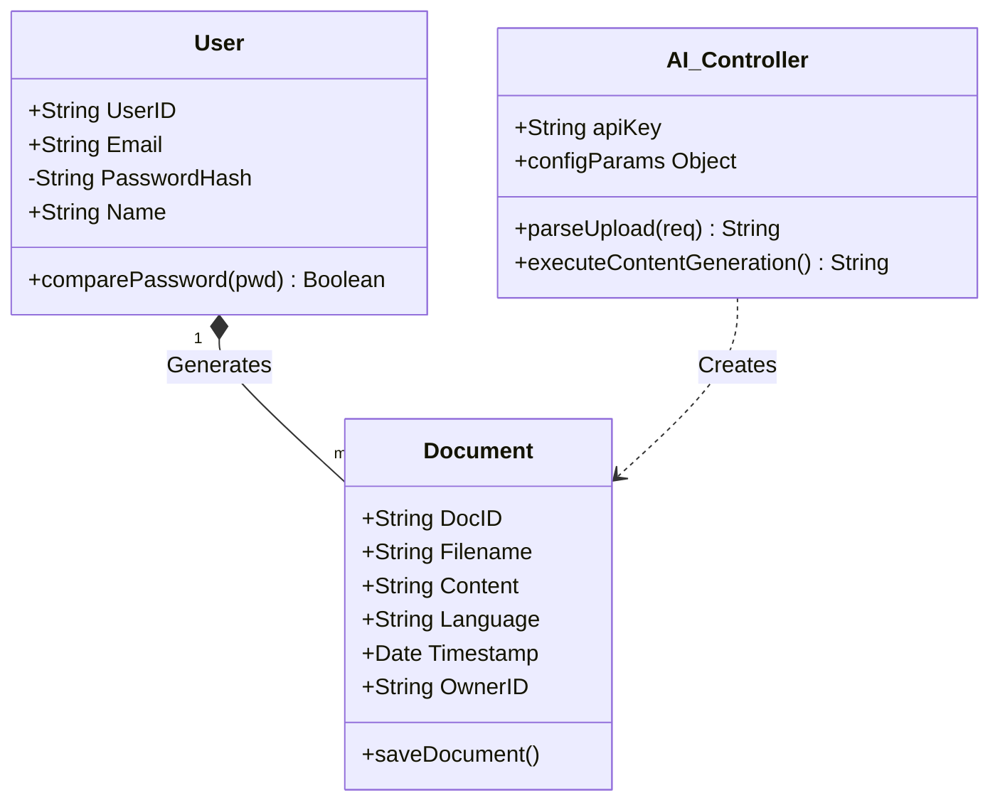

# Chapter 4: System Design

## 4.1 Introduction to System Design

System design is the turning point in any software project. It is the moment where discussions about *what* the application should do stop, and the exact blueprints for *how* to build it are drawn. A good system design ensures that the frontend, the backend server, the database, and any third-party APIs plug into each other perfectly.

For **QuillStack AI**, the design challenge was interesting: how to securely connect a traditional web application built on the MERN stack (MongoDB, Express, React, Node.js) with a massive external intelligence engine like the Google Gemini API? The solution was to design a highly modular, decoupled system. This means if Google ever changes its API, or if the React frontend is upgraded, those pieces can be cleanly replaced without breaking the entire application.

---

## 4.2 System Architecture Design

QuillStack AI operates on a classic **Client-Server Architecture**. This specific separation is crucial because the frontend (the client's browser) absolutely cannot be allowed to communicate directly to Google Gemini, otherwise, private API keys would be exposed to the public internet.

**How the Pieces Connect:**
1.  **Frontend (What the User Sees):** Built with React.js and Next.js, this layer lives entirely in the user’s web browser. It handles rendering buttons, forms, and the final Markdown documents.
2.  **Backend (The Air Traffic Controller):** Built on Node.js and Express.js, the backend server is the middleman. It receives the user's uploaded code, checks if the user is legally logged in, and acts as the secure bridge to the outside world.
3.  **Database (The Memory):** MongoDB is used to store all persistent data. When the backend needs to check a password or save a generated document, it communicates with MongoDB via Mongoose.
4.  **The AI API (The Brain):** When the backend is ready, it securely| **TC-007** | **Actions** | Clicked the Delete button on the Dashboard. | The row disappears and the MongoDB record is permanently removed. | Deleted perfectly; no residual data left in DB. | **PASS** |
| **TC-008** | **Admin** | Searched users rapidly (spamming keys). | System should debounce requests to stay under rate limits. | Search triggered exactly 500ms after last key, preventing 429 error. | **PASS** |
| **TC-009** | **Security**| Attempted to login after 5 failed tries. | System should temporarily rate-limit the IP address. | Request blocked with 'Too Many Requests' message as expected. | **PASS** |
to our backend.

---

## 4.3 Design Components

To keep the codebase from becoming a tangled mess, the system is divided into four main compartments:

### 4.3.1 Frontend Design
The user interface is built to be as simple and functional as possible. Using a component-based structure in React, specific screens were designed for logging in, viewing past generation history, and an interactive "Generation Workspace." This core workspace uses a side-by-side design: users put their source code on the left, and watch the beautifully formatted documentation appear on the right.

### 4.3.2 Backend Design
The backend is structured as a RESTful API. This means the server doesn't waste time sending heavy visual graphics to the user; it strictly sends lightweight JSON data. The backend was organized into clean routes—for instance, `/user` endpoints handle all authentication tasks, while `/docs` endpoints handle file uploads and AI generation. 

### 4.3.3 Database Design
Data is organized neatly into MongoDB collections. `Users` are kept completely separate from `Documents`. Instead of trying to cram every generated document directly inside a user's profile, the database is kept fast by storing the files independently. Every document is simply tagged with an `OwnerID`, which easily links it back to the person who generated it.

### 4.3.4 AI Integration Design
The connection to the Gemini API is completely stateless. This means Gemini doesn't remember who the users are; it simply answers the questions asked of it. The Express backend bundles up a massive JSON package containing strictly formatted instructions, sends it out, and completely pauses its own tasks (using JavaScript's `await` feature) until the generated text comes flowing gracefully back from Google's servers.

---

## 4.4 Data Flow Diagrams (DFD)

A Data Flow Diagram helps visualize exactly how digital information travels through the app.

### 4.4.1 Level 0 Context DFD
This diagram shows the absolute highest-level view of the project. The entire QuillStack application is just one big bubble sitting between the user and Google.

### 4.4.2 Level 1 DFD
Zooming inside the QuillStack bubble clearly reveals the four major pitstops data takes while moving through the backend.

---

## 4.5 Entity Relationship Diagram (ER Diagram)

The ER Diagram defines exactly how the data inside the MongoDB database relates to each other. 

As the diagram shows, the core relationship in the app is **One-to-Many (1:N)**. One beautifully unique user profile can generate hundreds of separate documents over time. However, every single document can only be owned by one specific user, tied together precisely by the `OwnerID` variable.

---

## 4.6 UML Diagrams

Unified Modeling Language (UML) diagrams are the industry standard for mapping out exactly how an application behaves in different scenarios.

### 4.6.1 Use Case Diagram
This breaks down the exact actions the two main user types (a Standard User and an Admin) are allowed to take inside the platform.

### 4.6.2 System Sequence Diagram
This is a timeline. When a user clicks the "Generate Document" button, here is the exact step-by-step sequence of how that request bounces back and forth across the architecture until the final output appears.

### 4.6.3 Structural Class Diagram
This is a developer-focused blueprint showing how the major data objects and controllers are structured in the actual JavaScript code.

---

## 4.7 User Interface Design

The goal for the UI was to keep the design incredibly straightforward so the user isn't overwhelmed by the powerful AI running behind the scenes.

1.  **Authentication Gates:** Strict, minimal login forms that immediately tell you if you typed a password wrong before even bothering the server.
2.  **Dashboard Modules:** A beautifully crafted, horizontal list-layout dashboard tracking a user's chronological generation history. Users can interact with any row to instantly View, download as PDF, Copy, Share, or securely Delete past documentation through seamless client-side interactions.
3.  **Document Management:** A MongoDB database that automatically saves and organizes every single document a user generates.
4.  **Interactive UX Suite:** A high-end frontend featuring an automated Product Tour, a Live Typewriter Demo, and smart context-aware navigation for logged-in users.

---

## 4.8 Security Design

Because uploaded user code and highly sensitive API keys are being handled, security is not an afterthought; it is built into the foundation.

### 4.8.1 Authentication (JWTs)
Old-school server sessions were discarded in favor of JSON Web Tokens (JWT). When a user successfully logs in, the backend encrypts their profile into a secure string. The user passes this JWT "digital VIP pass" every time they try to generate a document. If the token is fake or expired, the backend instantly rejects them.

### 4.8.2 Environmental Protection
It is explicitly ensured that the primary Google Gemini API Key is never accidentally uploaded to GitHub. The API Key is permanently decoupled from the main code and securely hidden completely inside a local `.env` configuration file on the server.

---

## 4.9 System Requirements

To run QuillStack AI smoothly, users and hosts only need to meet highly basic, modern computing standards.

### 4.9.1 Hardware Requirements
*   **Processor:** Any modern dual-core or multi-core processor.
*   **Memory:** At least 4GB of RAM to ensure the Node server doesn't crash during heavy generation requests.
*   **Networking:** A stable, high-speed internet connection is absolutely mandatory. Because the backend relies on Google's cloud API, dropped connections will severely break the generation loop.

### 4.9.2 Software Requirements
*   **Backend:** A system capable of running Node.js (Version 18+).
*   **Database:** A localized MongoDB installation or access to an external MongoDB Atlas Cloud cluster.
*   **Client Software:** Standard, updated modern web browsers (Chrome, Firefox, Safari) that can handle React's dynamic JavaScript rendering.

---

## 4.10 Summary

Chapter 4 thoroughly outlines the exact blueprints that take QuillStack AI from a theoretical idea to a deployable, functioning platform. By using a strict Client-Server decoupled model, it is ensured that the MERN stack brilliantly handles the heavy lifting of user management and database storage, while exclusively leaving the intensely complicated text generation to the Gemini API. Through these structured layouts, use-case visualizations, and precise database mapping, the platform guarantees a secure, scalable, and highly intuitive experience.
