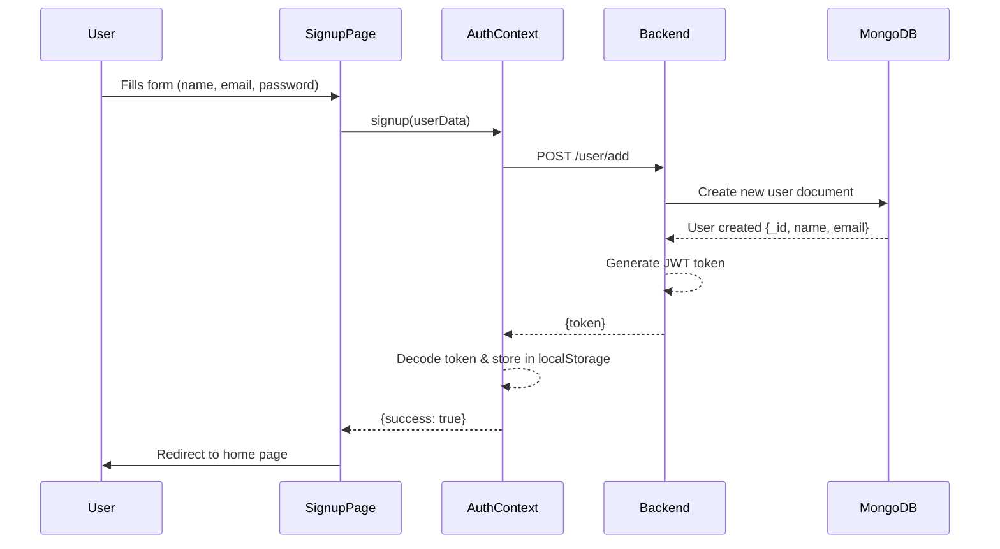
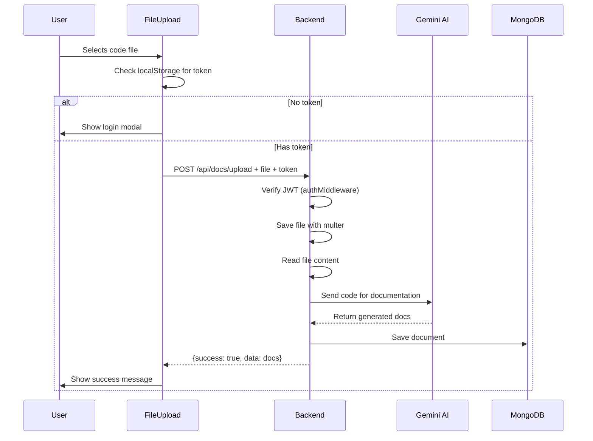

# QuillStack AI - Frontend to Backend Architecture Guide

## Table of Contents
1. [Overview](#overview)
2. [Project Structure](#project-structure)
3. [Backend API Architecture](#backend-api-architecture)
4. [Frontend Architecture](#frontend-architecture)
5. [Complete Data Flow Examples](#complete-data-flow-examples)
6. [Authentication System](#authentication-system)
7. [How the Code Was Written](#how-the-code-was-written)

---

## Overview

QuillStack AI is a **MERN stack application** (MongoDB, Express, React/Next.js, Node.js) that uses AI to generate documentation from code files. The application has two main user types:
- **Regular Users**: Can upload code files and generate documentation
- **Admins**: Can manage users and access admin dashboard

### Tech Stack
- **Frontend**: Next.js 14 (App Router), React, TailwindCSS, Framer Motion
- **Backend**: Node.js, Express, MongoDB, Gemini AI
- **Authentication**: JWT (JSON Web Tokens)
- **State Management**: React Context API

---

## Project Structure

### Backend Structure
```
backend/
├── index.js                 # Main server file - all routes mounted here
├── connection.js            # MongoDB connection
├── routers/
│   ├── userRouter.js        # User authentication routes (/user)
│   ├── adminRouter.js       # Admin management routes (/admin)
│   └── docRouter.js         # Document generation routes (/api/docs)
├── controllers/
│   ├── authController.js    # Authentication logic
│   └── docsControllers.js   # Document generation logic
├── models/
│   ├── User.js              # User schema (includes isAdmin field)
│   ├── docsModel.js         # Document schema
│   ├── uploadModel.js       # File upload schema
│   └── contactModel.js      # Contact form schema
├── middleware/
│   └── authMiddleware.js    # JWT verification middleware
└── uploads/                 # Temporary file storage
```

### Frontend Structure
```
frontend/src/
├── app/
│   ├── page.jsx             # Landing page
│   ├── (main)/              # Main app routes
│   │   ├── login/           # User login page
│   │   ├── signup/          # User signup page
│   │   ├── admin-login/     # Admin login page
│   │   ├── generate-docs/   # Doc generation page
│   │   └── mydocs/          # User's documents page
│   └── admin/               # Admin panel routes
│       ├── dashboard/       # Admin dashboard
│       └── manage-users/    # User management
├── components/
│   ├── FileUpload.jsx       # File upload component
│   ├── Navbar.jsx           # Main navigation
│   ├── AdminNavbar.jsx      # Admin navigation
│   ├── ProtectedRoute.jsx   # Route protection for users
│   └── AdminProtectedRoute.jsx  # Route protection for admins
├── context/
│   └── AuthContext.jsx      # Authentication state management
├── hooks/
│   └── useAuthForm.js       # Form handling hook
└── utils/
    └── validators.js        # Form validation utilities
```

---

## Backend API Architecture

### Entry Point: `index.js`

```javascript
const express = require('express');
const cors = require('cors');
require('./connection'); // MongoDB connection

const app = express();

// Middleware
app.use(cors({ origin: '*' }));
app.use(express.json({ limit: '10mb' }));

// Route Mounting
app.use('/user', require('./routers/userRouter'));      // User auth
app.use('/admin', require('./routers/adminRouter'));    // Admin
app.use('/api/docs', require('./routers/docRouter'));   // Docs

app.listen(5000);
```

### 1. User Router (`/user`)

**Endpoints:**
- `POST /user/add` - User signup
- `POST /user/authenticate` - User login
- `GET /user/getall` - Get all users

**Key Features:**
- Creates JWT token after signup/login
- Stores user data in MongoDB
- Returns token for authentication

### 2. Admin Router (`/admin`)

**Endpoints:**
- `POST /admin/login` - Admin login (checks isAdmin flag)
- `GET /admin/check` - Verify admin status
- `GET /admin/stats` - Get dashboard statistics
- `GET /admin/users` - Get all users (requires admin auth)
- `PUT /admin/users/:id` - Update user
- `DELETE /admin/users/:id` - Delete user

**Middleware Stack:**
1. `verifyToken` - Validates JWT
2. `verifyAdmin` - Checks if user has isAdmin: true

### 3. Document Router (`/api/docs`)

**Endpoints:**
- `POST /api/docs/upload` - Upload file and generate docs (requires auth)
- `GET /api/docs/export/:id/markdown` - Export document

**File Upload Flow:**
1. Uses `multer` for file handling
2. Reads file content
3. Sends to Gemini AI for documentation generation
4. Returns generated documentation
5. Cleans up uploaded file

---

## Frontend Architecture

### State Management: AuthContext

The `AuthContext.jsx` is the **central hub** for authentication across the entire frontend:

```javascript
// AuthContext provides:
const value = {
  user,          // Current user object with {id, name, email, token}
  loading,       // Loading state
  signup,        // Signup function
  login,         // Login function
  logout,        // Logout function
  isAuthenticated // Check authentication status
};
```

**How it works:**
1. Wraps entire app in `layout.jsx`
2. Stores user data in `localStorage`
3. Decodes JWT token to extract user info
4. Automatically checks token expiration
5. Provides authentication functions to all components

---

## Complete Data Flow Examples

### Flow 1: User Signup



**Code Flow:**

1. **Frontend: Signup Page** (`app/(main)/signup/page.jsx`)
```javascript
const { signup } = useAuth(); // Get signup from AuthContext

const handleSubmit = async (formData) => {
  const result = await signup(formData); // Call signup
  if (result.success) {
    router.push('/'); // Redirect on success
  }
};
```

2. **Frontend: AuthContext** (`context/AuthContext.jsx`)
```javascript
const signup = async (userData) => {
  // Make API call to backend
  const response = await fetch('http://localhost:5000/user/add', {
    method: 'POST',
    headers: { 'Content-Type': 'application/json' },
    body: JSON.stringify({
      name: userData.name,
      email: userData.email,
      password: userData.password
    })
  });
  
  const { token } = await response.json();
  
  // Store token
  localStorage.setItem('token', token);
  
  // Decode token to get user info
  const payload = JSON.parse(atob(token.split('.')[1]));
  const userInfo = {
    id: payload._id,
    name: payload.name,
    email: payload.email,
    token
  };
  
  // Store user in localStorage and state
  localStorage.setItem('user', JSON.stringify(userInfo));
  setUser(userInfo);
  
  return { success: true };
};
```

3. **Backend: User Router** (`routers/userRouter.js`)
```javascript
router.post('/add', (req, res) => {
  console.log(req.body); // {name, email, password}
  
  // Save to MongoDB
  new Model(req.body).save()
    .then((result) => {
      // Generate JWT token
      const { _id, name, email } = result;
      const payload = { _id, name, email };
      
      jwt.sign(payload, process.env.JWT_SECRET, { expiresIn: '1d' }, 
        (err, token) => {
          if (err) {
            res.status(500).json({ message: 'Error generating token' });
          } else {
            res.status(200).json({ token }); // Send token back
          }
        }
      );
    })
    .catch((err) => {
      if (err.code === 11000) {
        res.status(400).json({ message: 'Email already exists' });
      } else {
        res.status(500).json({ message: 'Internal server error' });
      }
    });
});
```

4. **Backend: MongoDB Model** (`models/User.js`)
```javascript
const userSchema = new mongoose.Schema({
  email: { type: String, required: true, unique: true },
  password: { type: String, required: true },
  name: { type: String },
  isAdmin: { type: Boolean, default: false }
});

module.exports = mongoose.model('User', userSchema);
```

---

### Flow 2: User Login

**Exact same flow as signup, but uses different endpoints:**
- Frontend calls: `login()` from AuthContext
- Backend endpoint: `POST /user/authenticate`
- Returns: JWT token with user data

---

### Flow 3: File Upload for Documentation Generation



**Code Flow:**

1. **Frontend: FileUpload Component** (`components/FileUpload.jsx`)
```javascript
const handleUpload = async () => {
  // Get token from localStorage
  const token = localStorage.getItem("token") || 
                localStorage.getItem("userToken");
  
  if (!token) {
    setShowLoginModal(true); // Show login modal if not authenticated
    return;
  }
  
  // Create FormData with file
  const formData = new FormData();
  formData.append("file", selectedFile);
  
  // Send to backend with Authorization header
  const res = await fetch("http://localhost:5000/api/docs/upload", {
    method: "POST",
    headers: { Authorization: `Bearer ${token}` }, // JWT token
    body: formData,
  });
  
  const data = await res.json();
  
  if (data.success && data.data) {
    toast.success("✅ Docs Generated Successfully!");
    onUploadSuccess(data.data); // Pass docs to parent
  }
};
```

2. **Backend: Auth Middleware** (`middleware/authMiddleware.js`)
```javascript
const authMiddleware = (req, res, next) => {
  const authHeader = req.headers.authorization; // "Bearer TOKEN"
  
  if (!authHeader || !authHeader.startsWith('Bearer ')) {
    return res.status(401).json({ error: 'No token provided' });
  }
  
  const token = authHeader.split(' ')[1]; // Extract token
  
  try {
    const decoded = jwt.verify(token, process.env.JWT_SECRET);
    req.user = decoded; // Attach user to request
    next(); // Continue to route handler
  } catch (error) {
    return res.status(401).json({ error: 'Invalid token' });
  }
};
```

3. **Backend: Doc Router** (`routers/docRouter.js`)
```javascript
const upload = multer({ dest: "uploads/" }); // File storage

router.post("/upload", authMiddleware, upload.single("file"), 
  async (req, res) => {
    if (!req.file) {
      return res.status(400).json({ 
        success: false, 
        message: "No file uploaded" 
      });
    }
    
    // Read file
    const filePath = req.file.path;
    const fileContent = fs.readFileSync(filePath, "utf-8").slice(0, 10000);
    
    // Create prompt for Gemini
    const prompt = `Generate documentation for:\\n\\n${fileContent}`;
    
    // Call Gemini AI
    const model = genAI.getGenerativeModel({ model: "gemini-2.0-flash" });
    const result = await model.generateContent(prompt);
    const docText = result.response.text();
    
    // Cleanup uploaded file
    fs.unlinkSync(filePath);
    
    // Return documentation
    res.json({
      success: true,
      modelUsed: "gemini-2.0-flash",
      data: docText,
    });
});
```

---

### Flow 4: Admin Login

**Key Difference from User Login:**
- Uses separate endpoint: `POST /admin/login`
- Checks `isAdmin: true` in database
- Stores token in `adminToken` (not `token`)
- Uses `axios` instead of `fetch`

**Code Flow:**

1. **Frontend: Admin Login Page** (`app/(main)/admin-login/page.jsx`)
```javascript
const handleSubmit = async (values) => {
  // Call admin login endpoint
  const response = await axios.post('http://localhost:5000/admin/login', {
    email: values.email,
    password: values.password,
  });

  if (response.data.success) {
    // Store admin token (separate from user token)
    localStorage.setItem('adminToken', response.data.token);
    localStorage.setItem('adminUser', JSON.stringify(response.data.user));
    
    // Redirect to admin dashboard
    router.push('/admin/dashboard');
  }
};
```

2. **Backend: Admin Router** (`routers/adminRouter.js`)
```javascript
router.post('/admin/login', async (req, res) => {
  const { email, password } = req.body;
  
  // Find user
  const user = await Model.findOne({ email });
  
  if (!user || user.password !== password) {
    return res.status(401).json({ message: 'Invalid credentials' });
  }
  
  // Check if user is admin
  if (!user.isAdmin) {
    return res.status(403).json({ 
      message: 'Access denied. Admin privileges required.' 
    });
  }
  
  // Generate token
  const payload = { _id: user._id, name: user.name, email: user.email };
  jwt.sign(payload, process.env.JWT_SECRET, { expiresIn: '1d' }, 
    (err, token) => {
      res.status(200).json({ 
        success: true,
        token,
        user: {
          _id: user._id,
          name: user.name,
          email: user.email,
          isAdmin: user.isAdmin
        }
      });
    }
  );
});
```

---

## Authentication System

### JWT Token Flow

**1. Token Generation (Backend)**
```javascript
// In userRouter.js or adminRouter.js
const payload = { _id: user._id, name: user.name, email: user.email };

jwt.sign(payload, process.env.JWT_SECRET, { expiresIn: '1d' }, 
  (err, token) => {
    res.json({ token });
  }
);

// Token structure: "header.payload.signature"
// Example: "eyJhbGc.eyJfaWQi.SflKxwRJ"
```

**2. Token Storage (Frontend)**
```javascript
// In AuthContext.jsx
localStorage.setItem('token', responseData.token);

// Decode token to get user info (no API call needed!)
const payload = JSON.parse(atob(token.split('.')[1]));
// payload = { _id: "...", name: "...", email: "...", exp: 1234567890 }

localStorage.setItem('user', JSON.stringify({
  id: payload._id,
  name: payload.name,
  email: payload.email,
  token
}));
```

**3. Token Verification (Backend)**
```javascript
// In authMiddleware.js
const token = req.headers.authorization.split(' ')[1];
const decoded = jwt.verify(token, process.env.JWT_SECRET);
req.user = decoded; // User info now available in route
```

**4. Token Usage (Frontend)**
```javascript
// In FileUpload.jsx or any API call
const token = localStorage.getItem("token");

fetch("http://localhost:5000/api/docs/upload", {
  headers: { Authorization: `Bearer ${token}` },
  // ...
});
```

### Two Separate Auth Systems

| Feature | User Auth | Admin Auth |
|---------|-----------|------------|
| Login endpoint | `/user/authenticate` | `/admin/login` |
| Token storage key | `token` | `adminToken` |
| User storage key | `user` | `adminUser` |
| Managed by | AuthContext | Direct axios calls |
| Database check | Email + password | Email + password + isAdmin |
| Protected routes | ProtectedRoute.jsx | AdminProtectedRoute.jsx |

---

## How the Code Was Written

### Development Pattern

**1. Backend First (API-Driven Development)**
```
Step 1: Set up MongoDB connection
↓
Step 2: Create models (User, Docs, etc.)
↓
Step 3: Write routers with all endpoints
↓
Step 4: Add middleware (auth, file upload)
↓
Step 5: Test with Postman/Thunder Client
```

**2. Frontend Integration**
```
Step 1: Create AuthContext for global state
↓
Step 2: Build login/signup pages
↓
Step 3: Connect to backend APIs
↓
Step 4: Add protected routes
↓
Step 5: Build feature components (FileUpload, etc.)
```

### Key Design Decisions

**1. Why Context API instead of Redux?**
- Simpler for authentication state
- Less boilerplate code
- Sufficient for this application size

**2. Why Two Separate Auth Systems?**
- **Security**: Admin tokens stored separately
- **Flexibility**: Can have different token expiration times
- **Clarity**: Clear separation between user and admin flows

**3. Why JWT instead of Sessions?**
- **Stateless**: Backend doesn't store session data
- **Scalable**: Works with multiple backend servers
- **Mobile-friendly**: Easy to use in mobile apps

**4. Why Next.js instead of Create React App?**
- **File-based routing**: Cleaner project structure
- **Server-side rendering**: Better SEO
- **Built-in optimization**: Image optimization, code splitting

### File Connection Pattern

Every frontend page follows this pattern:

```javascript
// 1. Import AuthContext
import { useAuth } from '@/context/AuthContext';

// 2. Get auth functions
const { login, user, isAuthenticated } = useAuth();

// 3. Make API call with token
const token = localStorage.getItem('token');
const response = await fetch('http://localhost:5000/...', {
  headers: { Authorization: `Bearer ${token}` }
});

// 4. Handle response
const data = await response.json();
```

### Environment Variables

**Backend (`.env`)**
```
PORT=5000
MONGODB_URI=mongodb://localhost:27017/quillstack
JWT_SECRET=your-secret-key
GEMINI_API_KEY=your-gemini-key
```

**Frontend** (Built into Next.js config)
```
API URL: http://localhost:5000
```

---

## Summary: Complete Connection Map

```
Frontend Component          →  API Endpoint              →  Backend Handler           →  Database
───────────────────────────────────────────────────────────────────────────────────────────────────
Signup Page (AuthContext)  →  POST /user/add            →  userRouter.js            →  User Model
Login Page (AuthContext)   →  POST /user/authenticate   →  userRouter.js            →  User Model
Admin Login Page           →  POST /admin/login         →  adminRouter.js           →  User Model
FileUpload Component       →  POST /api/docs/upload     →  docRouter.js + Gemini AI →  Docs Model
Admin Dashboard            →  GET /admin/stats          →  adminRouter.js           →  User Model
User Management            →  GET /admin/users          →  adminRouter.js           →  User Model
                          →  PUT /admin/users/:id      →  adminRouter.js           →  User Model
                          →  DELETE /admin/users/:id   →  adminRouter.js           →  User Model
```

### Data Flow Summary

1. **User enters data in form** (Frontend Component)
2. **Form calls Context API or makes direct API call**
3. **Request sent to backend with JWT token** (if authenticated)
4. **Backend middleware verifies token**
5. **Backend router handles request**
6. **Backend interacts with MongoDB or external API**
7. **Backend sends response**
8. **Frontend updates UI or stores data**

---

## Key Takeaways

✅ **Authentication**: Managed by AuthContext, uses JWT tokens stored in localStorage

✅ **API Communication**: All API calls use `fetch` or `axios` with `http://localhost:5000`

✅ **State Management**: AuthContext provides user state globally

✅ **Security**: JWT tokens sent in `Authorization: Bearer <token>` header

✅ **File Upload**: Uses `multer` middleware, processes with Gemini AI

✅ **Admin vs User**: Separate authentication flows, admin checked via `isAdmin` flag

✅ **Database**: MongoDB with Mongoose models

This architecture creates a clean separation between frontend and backend, with JWT tokens as the bridge connecting authenticated requests!
